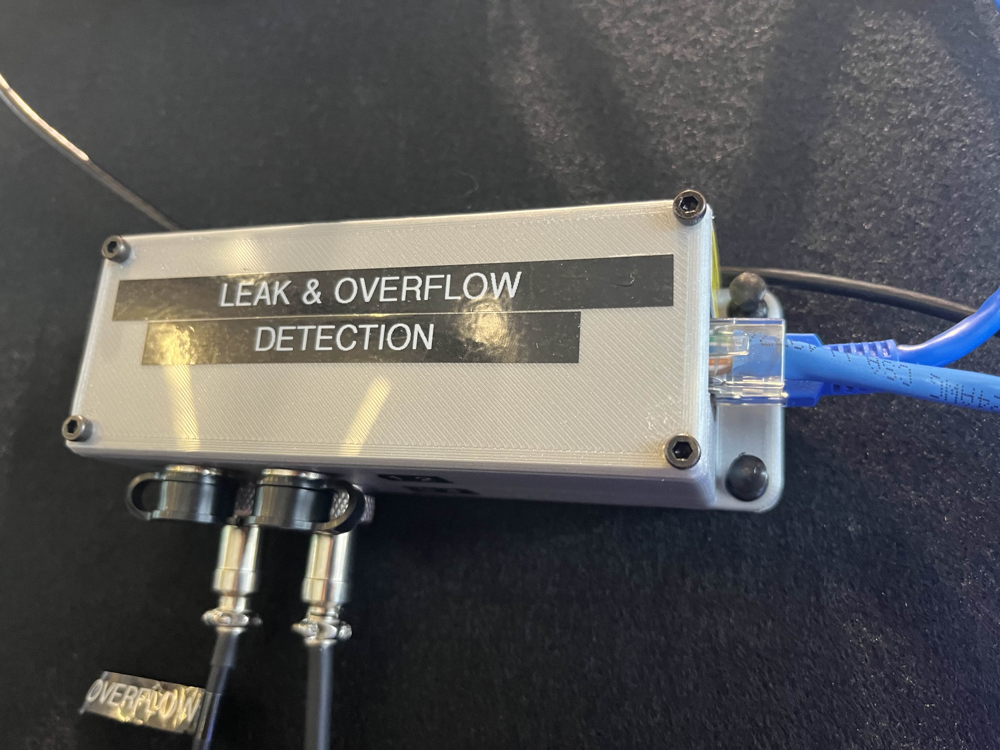
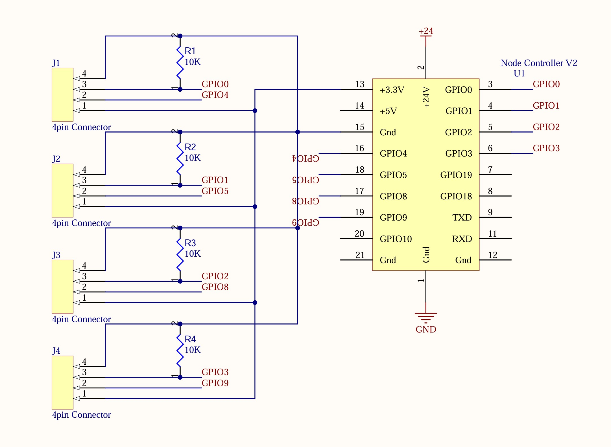

# Device-LeakSensor
Node device for sensing water leaks and tank level. It supports four inputs of any combination of leak sensors and float switchs.

## Hardware

All four plugs are wired for both a leak sensors and a float switch. The analog input on the leak sensor is pulled low so that if no leak sensor is connected, the input will read 0 volts(no leak).

## Firmware

### Message IDs and Format

| Parameter | Message ID | Data Format |
| --------- | ---------- | ----------- |
| Leak Sensor 1 | 0x0A01 | bool, 1 = leak detected|
| Leak Sensor 2 | 0x0A02 | bool, 1 = leak detected|
| Leak Sensor 3 | 0x0A03 | bool, 1 = leak detected|
| Leak Sensor 4 | 0x0A04 | bool, 1 = leak detected|
| Float Switch 1 | 0x0B01 | bool 1, = float activated |
| Float Switch 2 | 0x0B02 | bool 1, = float activated |
| Float Switch 3 | 0x0B03 | bool 1, = float activated |
| Float Switch 4 | 0x0B04 | bool 1, = float activated |
